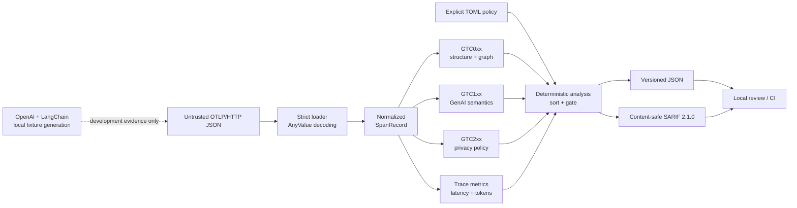

# GenAI TraceCheck portfolio evidence

GenAI TraceCheck is a deterministic Python linter for OpenTelemetry GenAI traces. It was built as a
two-week, evidence-first open-source project: no LLM judges, no provider network dependency, and no
claim that local policy is an official conformance certificate.

## What the project demonstrates

- Product boundary design: untrusted OTLP/HTTP JSON becomes strict internal records before any rule
  or policy logic runs.
- Standards work: 20 independently addressable rules separate OTLP structure, published GenAI
  semantic conventions, and explicitly local privacy policy.
- Reproducible integration evidence: official OpenAI and LangChain instrumentation packages generate
  frozen, content-addressed fixtures through local mock/fake backends.
- CI and packaging: Python 3.11/3.12 run lint, branch coverage, compatibility regeneration, benchmark
  smoke, the portfolio demo, CLI checks, wheel/sdist builds, and clean artifact installation.
- Performance engineering: a retained cumulative profile justified one local optimization; broader
  architectural changes were rejected without sufficient evidence.

## Architecture



The analyzer is offline and framework-neutral. Framework libraries run only in the development
fixture pipeline; their captured values never become rule diagnostics or SARIF content. See the
full [`architecture and trust-boundary document`](architecture.md).

The final three semantic rules use the same pinned GenAI convention as the compatibility matrix:
the execute-tool table marks `gen_ai.tool.name` as required, the inference table defines finish
reasons as `string[]`, and it defines `server.port` as an integer. `GTC112` additionally rejects zero
because [IANA records transport port 0 as reserved](https://www.iana.org/assignments/service-names-port-numbers?page=1&search=0),
and rejects values above the registry's 16-bit upper bound. This is value validation only; it does
not resolve the separate Day 13 question of whether an implicit default port must be emitted.

## Measured evidence

The committed benchmark uses generator version `1.0`, seed `20260926`, one warm-up, and three timed
samples per phase. These are medians from CPython 3.13.9 on one arm64 macOS machine, not universal
performance promises.

| Spans | End-to-end median | Throughput | Peak Python allocation |
| ---: | ---: | ---: | ---: |
| 1,000 | 0.009846 s | 101,564 spans/s | 4.84 MiB |
| 10,000 | 0.124605 s | 80,254 spans/s | 48.37 MiB |
| 100,000 | 1.677553 s | 59,611 spans/s | 483.60 MiB |

The profile-backed token-validation change improved the recorded 100K analysis median by 20.2% and
end-to-end median by 10.5%. JSON loading remains the dominant 100K memory cost. Exact samples,
fixture digests, methodology, caveats, and before/after profiles are in the
[`performance report`](performance.md).

## Acceptance evidence

| Release criterion | Evidence |
| --- | --- |
| At least 20 independently tested rules | `RULE_METADATA`, focused boundary tests, and SARIF catalog coverage |
| Two real instrumentation sources | Pinned OpenAI and LangChain packages, local generators, fixture digests |
| Stable JSON and SARIF contracts | Strict Pydantic reports, SARIF tests, deterministic fingerprints |
| Reproducible benchmark and compatibility matrix | Fixed seed/digests and generator `--check` paths |
| Supported-version CI and clean install | Python 3.11/3.12 matrix; isolated wheel and sdist smoke tests |
| Official convention vs local policy boundary | `GTC1xx`/`GTC2xx` separation and pinned standards snapshot |

The compatibility snapshot analyzes ten committed fixtures containing 20 spans and 10 traces. Four
positive synthetic fixtures and both framework fixtures pass; four negative fixtures fail exactly as
declared. The matrix records required, conditional, recommended, opt-in, deprecated, and local-policy
observations separately. It is not presented as an official Weaver conformance result.

## Try it in under a minute

```bash
python -m venv .venv
source .venv/bin/activate
python -m pip install -e ".[dev]"
python tools/demo.py
```

The demo proves a passing fixture, an expected quality-gate failure, and content-safe SARIF with
stable fingerprints. Its exact output and interpretation are documented in the
[`demo guide`](demo.md).

## Honest resume bullets

- Built an offline Python CLI that validates OpenTelemetry GenAI traces with 20 deterministic
  structure, semantic, and privacy rules; emitted versioned JSON and content-safe SARIF for CI.
- Created reproducible OpenAI and LangChain instrumentation fixtures plus a ten-fixture compatibility
  matrix, preserving package versions and SHA-256 provenance without provider network calls.
- Profiled a fixed-seed 100K-span workload and removed repeated token validation, improving the
  recorded analysis median by 20.2% and end-to-end median by 10.5% while retaining 98% combined
  statement/branch coverage.

These bullets describe implemented and measured work. They intentionally make no claims about
external adoption, production deployment, upstream acceptance, or universal benchmark performance.

## Reproduce the evidence

```bash
ruff check .
ruff format --check .
coverage run -m pytest
coverage report
python tools/compatibility-matrix/generate.py --check
python -m benchmarks.run --sizes 100 --repeats 1 --warmups 0 --no-profile \
  --output /tmp/tracecheck-benchmark-smoke.json
python tools/demo.py
python -m build
python tools/clean-install-smoke.py dist/*.whl dist/*.tar.gz
```

The final tag is created only from the merged `main` commit after both supported CI jobs pass.
